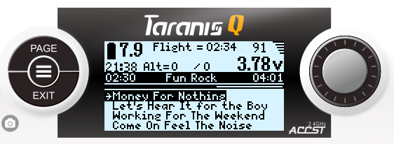
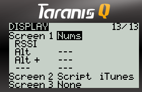

TaraniTunes v3.0
===========
**Awesome music player for FrSky radios.**  
*This is a separate Advanced fork from the Original TaraniTunes developed by [GilDev](https://github.com/GilDev)
It was agreed by GilDev and I that both versions of the script (the original and this advanced version) would be available for users but hosted separately.*

**The majority of the new enhancements are due to the work of [Exean](https://github.com/exean)**

Key Enhancements
----------------
** Xlite Radio's now supported    
** Streamlined screen layout    
** Easily point the program to the [Multiple Playlists].    
** The only limit to the number of playlists is SD Card size.    
** Eliminated the use S2 to select playlist (Pot freed up).    
** Number of songs in the playlist is displayed on the selection screen.    
** More screen room for telementry items.    
** Progress Bar for the playing song length.    

Existing Features
-----------------
** Playlists are separated by recognizable names you have chosen (3D Flying, Rock-N-Roll, Classic Rock, My Mix, Relaxing).   
** On-screen confirmation of the playlist selected.    
** Automatic song advancement.   
** Compatible with FrSky’s [Taranis Q X7](https://www.frsky-rc.com/product/taranis-q-x7-2), [Taranis Xlite](https://www.frsky-rc.com/product/taranis-x-lite/), [Taranis X9D](https://www.frsky-rc.com/product/taranis-x9d-plus-2) and their variants running at least [OpenTX](http://www.open-tx.org) 2.2.    

* Taranis Q X7 and Xlite  
    
* Taranis X9D  
  
* Playlist Selection Menu    
      
  
### Installation

A full working version for you to try on companion is available from my dropbox.  It uses your existing radio notifications as the sample music.  [Download SD Card files](https://www.dropbox.com/s/shfowg897nqdq2m/iTunes.zip?dl=0) The Model file contains 1 preset model so you can test drive the program on Companion or the Firmware Simulator.   

1. On your computer:
	1. Edit both `iTunes_player.lua` and `itunes.lua` to have your desired amount of playlists. Detailed instructions are in the file(s) comments. Place both files in the `/SCRIPT/TELEMETRY` directory on your SD card.  

	2. Create a folder "lists" under /SOUNDS

	3. Create separate folders under "lists" for each desired playlist on your SD card. The folder names should pertain to the music played. **Do not add spaces to the directory names**
Examples >> `/SOUNDS/lists/3dflying`, `/SOUNDS/lists/practice`, `/SOUNDS/lists/hardrock`, `/SOUNDS/lists/competition`

2. Create a "playlist.lua" file in each of those directories.
	1. I recommend using [`Mp3tag`](https://www.mp3tag.de/en/index.html) to create your playlists. It will automatically add the required informations in TaraniTunes’ format. *Please look at the instructions in [`Auto_Playlist`](/Auto_Playlist)*.

	2.  If you prefer to manually create the playlist files. Each line must be formatted like this:   
	`{"Song name", "SONG_FILENAME", duration},`
		1. `Song name` is the full name, with artist if you want.
		2. `SONG_FILENAME` must be 6 characters or less.
		3. `duration` is your song’s duration in seconds. *EXAMPLE - Your song is 3:45 long you would enter 225. For a 4:52 song enter 292. Simply calculate `minutes × 60 + seconds` to get your song’s duration. Song length can usually be found in the file’s properties.*  

 Look at [playlist.lua](playlist.lua) for an example of the required structure of the file.

3. Put your corresponding songs `SONG_FILENAME.wav` in `/SOUNDS/en` if your radio is in English (otherwise replace `en` with your language). They must be converted to mono, preferably normalized, and encoded in Microsoft WAV 16-bits signed PCM at a 32 kHz sampling rate, you can use [Audacity](http://www.audacityteam.org) to do that, it works great. Remember the filename must be 6 characters or less or else it will not play.

4. On your Taranis or (in companion) **This is how I setup my radio:
	1. Set “TIMER3” as follows:      
	  
	2. Set active “FLIGHT MODES” model rudder trims as follows:     
	  
	In fact, put every rudder trim to “`--`” for every flight mode you use.  
	XLITE users Use the Aileron or Elevator trims (Rudder requires the use of the shift button).    
	3. Set “LOGICAL SWITCHES” settings as follows:  
	  
	**L60 will be automatically installed there is no need to enter these values**
	4. Under Telemetry “DISPLAY” Choose to display `Script iTunes`  
	

There you go! Next section will explain how to use TaraniTunes.

### Usage

From the main screen, hold “Page” to access TaraniTunes.
1. Put the “SB” switch in the middle position to start playing.
2. Put the "SB" switch in the down position to pause the song. It will continue from where it left off when the switch is returned to the middle "play" position.
3. Put “SB” in the up position to select a random song from your playlist. It will play when the switch is placed in the middle "play" position.
4. When the song ends, the next song will automatically play and “Timer3” will be reset.
5. “Timer3” will also automatically reset if you change songs.
6. Press rudder trim right or rudder trim left to play next or previous song respectively.
7.  The screen does not have to be displayed for it to work.  You can have the music playing and use the telemetry screen of your choice.  

If you move the "`SB`" switch or trims the music will respond accordingly.  The only function that will not work on a different screen is selecting a new playlist (described below).

#### Changing Playlists

1. To change playlists press “MENU”.   
2. A “Change Playlist Screen” will appear:  
     
3. Using  the **Wheel**, *Q X7* or the **[+/-] Buttons** *X9D* or the **[Up/Down] Joystick** to select the playlist you want to play.    
4. Press “ENTER”, your new playlist is loaded and begins playing.   

Enjoy it as much as I do.    

####  Housekeeping Notes  
Neither the firmware simulator nor Companion can compile all of the `playlist.lua` scripts to allow you to test drive and tweek it.  This must be done on the radio after you set your directories in the `iTunes.lua` file and have created the playlists. After compiling the playlists you can modify the screen layout in `iTunes_Player.lua` to reflect your personal taste or make futher enhancements
